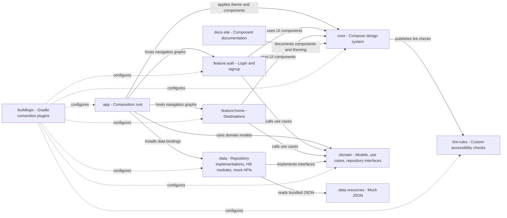

# CodeWithSandip — Design System + Sample App

A two-in-one Android project:

1. **CWS Design System** (`:core`) — a Jetpack Compose component library with design
   tokens, theming (light/dark + custom brand), and a curated set of components.
2. **A sample app** that consumes the design system to demonstrate a production-style, **feature-based
   Clean Architecture + MVVM** setup with **Hilt** DI, a mocked data layer, and Navigation Compose.

### 📖 Documentation site → <https://ersandip94.github.io/android-design-system/>

Browse the design-system components with light/dark previews, theming guides, and usage.

## Demo login

| Field | Value |
|---|---|
| Email | `demo@codewithsandip.com` |
| Password | `password123` |

Or tap **Sign up** to register any account (kept in an in-memory mock store for the session).

---

## Architecture

**Feature-based modularization + Clean Architecture.** Each feature is a self-contained Gradle
module that owns its UI and ViewModels and depends only on the shared *core* modules — never on
another feature. Within a feature, layering follows `presentation → domain ← data`.



### Module types

| Type | Modules | Responsibility |
|---|---|---|
| **App** | `:app` | Composition root — Navigation host, theme switching, Hilt bootstrap |
| **Feature** | `:feature:auth`, `:feature:home` | Vertical slices: screens + `@HiltViewModel`s + nav graph |
| **Core / shared** | `:core`, `:domain`, `:data` | Reusable layers shared across features |
| **Tooling** | `:lint-rules`, `:buildlogic` | Custom lint checks · Gradle convention plugins |

- **`:core`** — the design system (Compose components, theme, tokens). See [`core/README.md`](core/README.md).
- **`:domain`** — pure Kotlin: models, repository interfaces, use cases, validators (no Android).
- **`:data`** — repository implementations, mock JSON-backed APIs, Hilt modules.

### Dependency rules

```
:app ──▶ :feature:auth ─┐
     ──▶ :feature:home ─┼──▶ :core    (design system)
     ──▶ :data          └──▶ :domain  (models + use cases)
            └──────────────▶ :domain
```

- A feature depends on `:core` + `:domain` only — **never** on `:data` or on another feature.
- Only `:app` depends on `:data` (so Hilt can register its modules); features receive repository
  *interfaces* by injection.
- `:domain` is pure Kotlin and **annotation-free** — Hilt lives only in the Android layers.
- Common build config lives in `:buildlogic` convention plugins, so each module's build file is
  ~10 lines (`cws.android.feature`, `cws.android.data`, `cws.kotlin.library`, …).

**Principles**

- **Clean Architecture** — `presentation → domain ← data`. `:domain` is pure Kotlin and
  annotation-free; Hilt lives only in the Android layers.
- **MVVM + UDF** — ViewModels expose immutable `StateFlow<UiState>`; screens are stateless and
  driven by state + callbacks; one-shot events flow through a `Channel`.
- **DI with Hilt** — interfaces are bound in `:data`; ViewModels are `@HiltViewModel`.
- **Mocked network** — `:data` deserializes bundled JSON "responses" (`mock/destinations.json`,
  `mock/users.json`) with `kotlinx.serialization`, with simulated latency for real loading states.
- **Result type** — layers exchange `kotlin.Result<T>`; a typed `AppError` rides inside an
  `AppException` (see `appErrorOrNull()` / `appFailure()`).

---

## The design system (`:core`)

Design tokens (`CWSColors`, `CWSSpacing`, `CWSTypography`, `CWSShape`, `CWSElevation`, `CWSMotion`),
theming (`CWSTheme`, light/dark/custom `CWSColorScheme`), and components:

`CWSButton` · `CWSTextField` · `CWSCard` · `CWSBadge` · `CWSChip` · `CWSDialog` · `CWSBottomSheet`
· `CWSTopBar` · `CWSNavigationBar` · `CWSCheckbox` / `CWSRadioButton` / `CWSSwitch` / `CWSSlider`

Every component reads colors/spacing/shapes from the theme, ships `@Preview`s, meets a 48dp touch
target, and has accessibility semantics. A custom lint check (`CWSMissingContentDescription`) ships
with the AAR to nudge consumers toward labeled UI.

```kotlin
CWSTheme {
    CWSButton(text = "Continue", onClick = { /* … */ })
}
```

---

## Sample app flow

**Launch → Login / Sign up → Destinations (10 places) → Detail → Sign out**, with live
Light / Dark / System theme switching from the top bar throughout.

---

## Tech stack

| | |
|---|---|
| Language | Kotlin 2.2.10 |
| UI | Jetpack Compose (BOM 2026.05.01), Material 3 |
| Build | AGP 9.2.1, Gradle 9.4.1 (with built-in Kotlin) |
| DI | Hilt 2.59.2 (+ KSP) |
| Async | Coroutines + Flow |
| Serialization | kotlinx.serialization (JSON) |
| Navigation | Navigation Compose |
| Min / compile SDK | 24 / 36 (`:core`), 37 (app stack) |

---

## Build & run

```bash
# Build everything
./gradlew assembleDebug

# Install the app on a connected device/emulator
./gradlew :app:installDebug

# Or open in Android Studio and run the :app configuration
```

---

## Testing

```bash
# All JVM unit tests (domain, data, feature ViewModels, design-system tokens/theme, lint rule)
./gradlew test testDebugUnitTest

# Record / verify design-system screenshot goldens (Compose Preview Screenshot Testing)
./gradlew :core:updateDebugScreenshotTest
./gradlew :core:validateDebugScreenshotTest

# Run the custom lint check
./gradlew :core:lintDebug

# Instrumented (Compose UI) tests — see the note below
./gradlew :core:connectedDebugAndroidTest
```

**Test coverage**

- **Unit** — use cases & validators (`:domain`), repository impls & JSON parsing (`:data`),
  ViewModels via Turbine + a `MainDispatcherRule` (`:feature:*`), tokens/theme (`:core`), and the
  lint detector (`:lint-rules`).
- **Screenshot** — 64 light/dark goldens across all design-system components.
- **Instrumented UI** — Compose UI tests for the components (and ready for the feature screens).

> ⚠️ **Instrumented tests need an emulator on API ≤ 36.** On API 37, Espresso 3.7.0 reflects on the
> removed `InputManager.getInstance()` and every instrumented test fails during setup. Unit and
> screenshot tests are unaffected.

---

## Project layout

```
codewithsandip-ds/
├─ app/            Sample application
├─ feature/
│  ├─ auth/        Login + Signup feature
│  └─ home/        Destinations feature
├─ core/           Design system (publishable as com.codewithsandip:ds-core)
├─ domain/         Pure-Kotlin domain layer
├─ data/           Mock data layer
├─ lint-rules/     Custom lint checks
├─ buildlogic/     Convention plugins
└─ docs/           Architecture plan
```

---

## License

Apache License 2.0.

*CodeWithSandip — built with Kotlin + Jetpack Compose · [codewithsandip.com](https://codewithsandip.com)*
