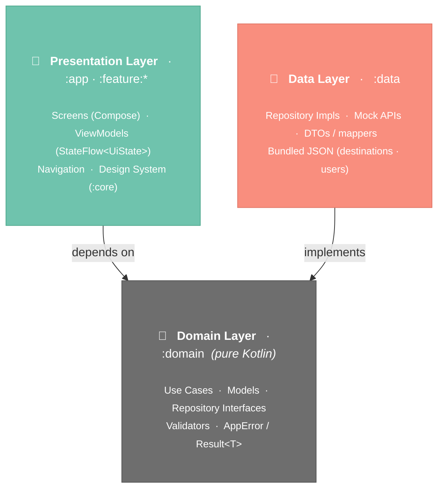
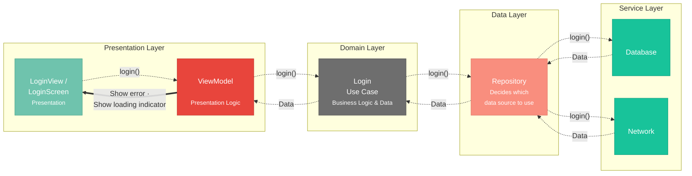
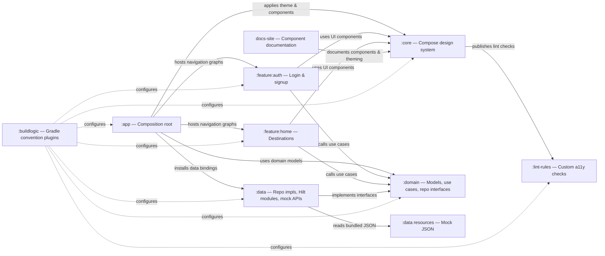

# Architecture

The CWS Design System ships inside a **production-grade sample app** that demonstrates
**feature-based modularization + Clean Architecture** with **Hilt** DI, a mocked data layer, and
Navigation Compose.

Each feature is a self-contained Gradle module that owns its UI and ViewModels and depends only on
the shared *core* modules — never on another feature. Within a feature, layering follows
`presentation → domain ← data`.

## Layered architecture

What lives in each layer. Dependencies point **downward** toward `:domain` — the pure-Kotlin core
that knows nothing about Android, UI, or data sources. (See [Login flow](#login-flow-request-lifecycle)
below for how a call actually moves through these layers.)



!!! note "Background & services"
    WorkManager and a core Service aren't part of the app yet. When added, they'd sit alongside the
    Data layer (scheduling work, then calling Use Cases) — a natural extension point for later.

## Login flow (request lifecycle)

How a single `login()` call travels **outward** to the data sources and how data flows **back** to
the UI — the runtime counterpart to the static layers above.



- **`login()` forward** — UI → ViewModel → Use Case → Repository → data source. Each layer only
  knows the *next inward* abstraction, never the concrete implementation.
- **`Data` back** — the source returns data the same way in reverse; the Repository decides whether
  it came from cache (Database) or the wire (Network).
- **UI reacts** — the ViewModel maps the result into `LoginUiState` (loading / error / success);
  the View just renders state.

!!! note "In this codebase"
    Screens are **Compose** (`LoginScreen`), not Fragments, and the "Network" source is a
    **mock API over bundled JSON**. The flow and layer boundaries are otherwise identical.

## Module dependency graph

How the Gradle modules wire together at build time (a complement to the runtime layers above).



## Module types

| Type | Modules | Responsibility |
|---|---|---|
| **App** | `:app` | Composition root — navigation host, theme switching, Hilt setup |
| **Feature** | `:feature:auth`, `:feature:home` | Vertical slices: screens + `@HiltViewModel`s + nav graph |
| **Core / shared** | `:core`, `:domain`, `:data` | Reusable layers shared across features |
| **Tooling** | `:lint-rules`, `:buildlogic` | Custom lint checks · Gradle convention plugins |

- **`:core`** — the design system (Compose components, theme, tokens).
- **`:domain`** — pure Kotlin: models, repository interfaces, use cases, validators (no Android).
- **`:data`** — repository implementations, mock JSON-backed APIs, Hilt modules.

## Dependency rules

```
:app ──▶ :feature:auth ─┐
     ──▶ :feature:home ─┼──▶ :core    (design system)
     ──▶ :data          └──▶ :domain  (models + use cases)
            └──────────────▶ :domain
```

- A feature depends on `:core` + `:domain` only — **never** on `:data` or on another feature.
- Only `:app` depends on `:data` (so Hilt can register its modules); features receive repository
  *interfaces* by injection.
- `:domain` is pure Kotlin and **annotation-free** — Hilt lives only in the Android layers.
- Common build config lives in `:buildlogic` convention plugins, so each module's build file is
  ~10 lines (`cws.android.feature`, `cws.android.data`, `cws.kotlin.library`, …).

## Principles

- **Clean Architecture** — `presentation → domain ← data`. `:domain` is pure Kotlin and
  annotation-free; Hilt lives only in the Android layers.
- **MVVM + UDF** — ViewModels expose immutable `StateFlow<UiState>`; screens are stateless and
  driven by state + callbacks; one-shot events flow through a `Channel`.
- **DI with Hilt** — interfaces are bound in `:data`; ViewModels are `@HiltViewModel`.
- **Mocked network** — `:data` deserializes bundled JSON "responses" (`mock/destinations.json`,
  `mock/users.json`) with `kotlinx.serialization`, with simulated latency for real loading states.
- **Result type** — layers exchange `kotlin.Result<T>`; a typed `AppError` rides inside an
  `AppException` (see `appErrorOrNull()` / `appFailure()`).

---

*See the [README](https://github.com/ersandip94/android-design-system#architecture) for the full
write-up, or [Get started →](getting-started.md) using the design system.*
