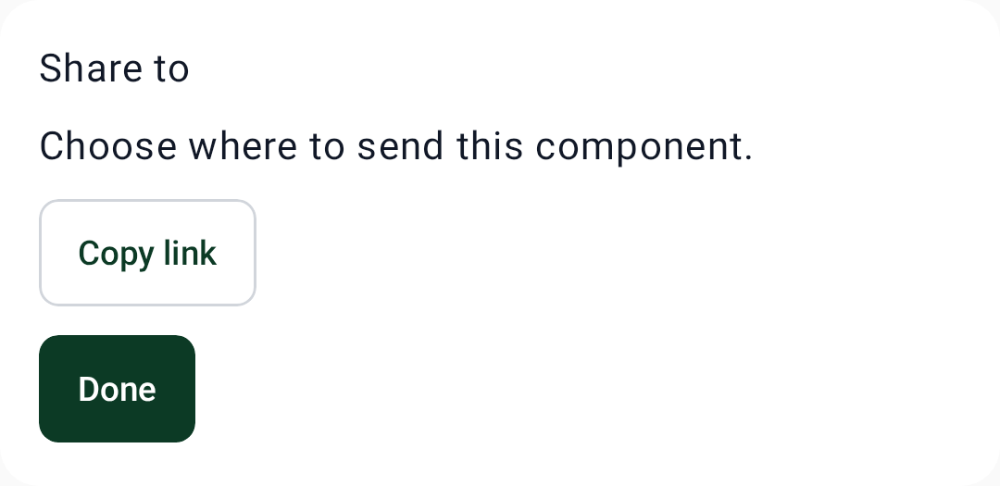
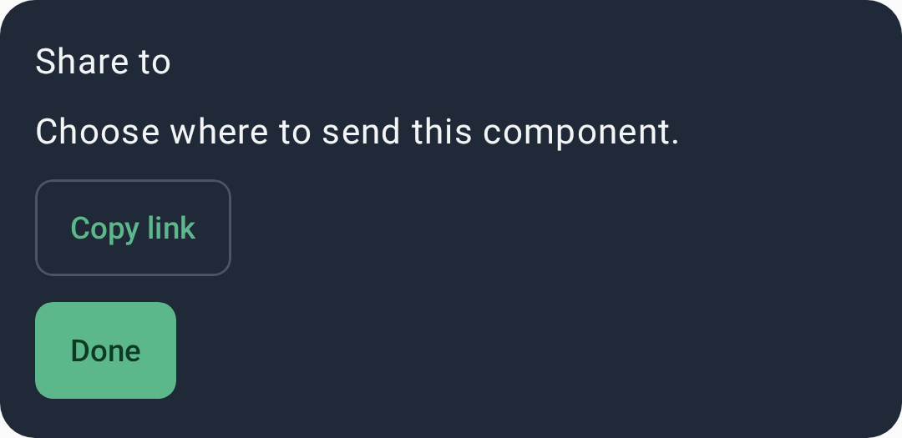

# Bottom sheet

`CWSBottomSheet` — a modal sheet that slides up from the bottom edge for contextual actions or
content. (The preview shows the sheet's content on the themed surface.)

=== "Light"
    { width="360" }
=== "Dark"
    { width="360" }

## Usage

```kotlin
if (showSheet) {
    CWSBottomSheet(onDismissRequest = { showSheet = false }) {
        Text("Share to", style = MaterialTheme.typography.titleMedium)
        CWSButton("Copy link", onClick = { }, variant = CWSButtonVariant.Secondary)
        CWSButton("Done", onClick = { showSheet = false })
    }
}
```

## Parameters

| Parameter | Type | Description |
|---|---|---|
| `onDismissRequest` | `() -> Unit` | Scrim tap / drag down / back |
| `skipPartiallyExpanded` | `Boolean` | Open fully, skipping the half-expanded state |
| `content` | `@Composable ColumnScope.() -> Unit` | Sheet body |
