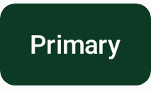
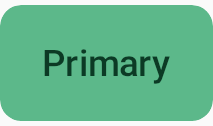

# Button

`CWSButton` — the primary action button. Four variants, three sizes, loading and disabled states,
and optional leading/trailing icons. Always meets a 48dp touch target with built-in semantics.

=== "Light"
    { width="360" }
=== "Dark"
    { width="360" }

## Usage

```kotlin
CWSButton(
    text = "Continue",
    onClick = { },
    variant = CWSButtonVariant.Primary,
    size = CWSButtonSize.Medium,
    loading = false,
    leadingIcon = Icons.Default.Add,
    contentDescription = "Continue",
)
```

## Variants

| Variant | Use for |
|---|---|
| `Primary` | The main, high-emphasis action |
| `Secondary` | Outlined, medium-emphasis action |
| `Ghost` | Text-only, low-emphasis action |
| `Danger` | Destructive action (uses the error color) |

## Parameters

| Parameter | Type | Default | Description |
|---|---|---|---|
| `text` | `String` | — | Label |
| `onClick` | `() -> Unit` | — | Click handler |
| `variant` | `CWSButtonVariant` | `Primary` | Visual style |
| `size` | `CWSButtonSize` | `Medium` | `Small` · `Medium` · `Large` |
| `enabled` | `Boolean` | `true` | Interaction enabled |
| `loading` | `Boolean` | `false` | Replaces the label with a spinner |
| `leadingIcon` / `trailingIcon` | `ImageVector?` | `null` | Optional icons |
| `contentDescription` | `String?` | `null` | Accessibility label (defaults to `text`) |
