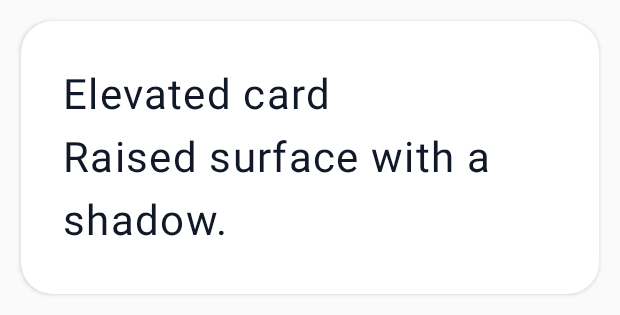
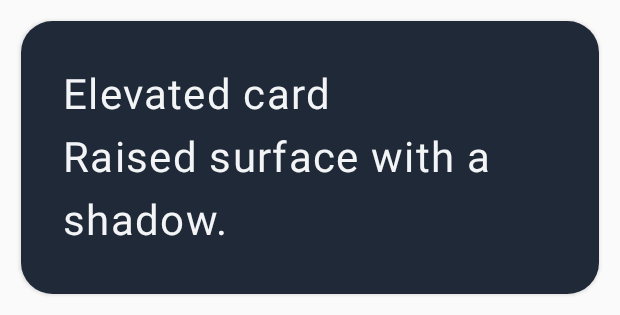

# Card

`CWSCard` — a container surface for grouping related content. `Elevated`, `Outlined`, or `Filled`.
Pass `onClick` to make the whole card a single tappable target.

=== "Light"
    { width="360" }
=== "Dark"
    { width="360" }

## Usage

```kotlin
CWSCard(variant = CWSCardVariant.Elevated, onClick = { }) {
    Text("Title", style = MaterialTheme.typography.titleMedium)
    Text("Supporting text")
}
```

## Variants

| Variant | Description |
|---|---|
| `Elevated` | Raised surface with a shadow |
| `Outlined` | Flat surface with an outline |
| `Filled` | Flat surface tinted with the primary container |

The card body is laid out in a `ColumnScope`; inner padding comes from the theme's spacing scale.
