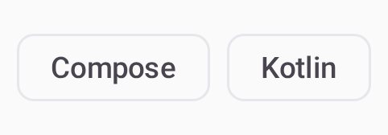
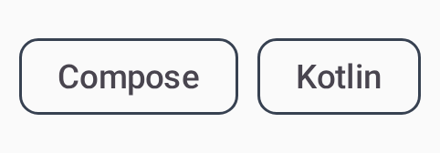

# Chip

`CWSChip` — a compact chip for filters, entries, and suggestions.

=== "Light"
    { width="360" }
=== "Dark"
    { width="360" }

## Usage

```kotlin
CWSChip("All", onClick = { }, variant = CWSChipVariant.Filter, selected = true)
CWSChip("sandip@x.com", onClick = { }, variant = CWSChipVariant.Input, onClose = { })
CWSChip("Kotlin", onClick = { }, variant = CWSChipVariant.Suggestion)
```

## Variants

| Variant | Description |
|---|---|
| `Filter` | Toggleable, reflects a `selected` state |
| `Input` | A discrete entry; pass `onClose` for a remove action |
| `Suggestion` | A tappable suggestion |
