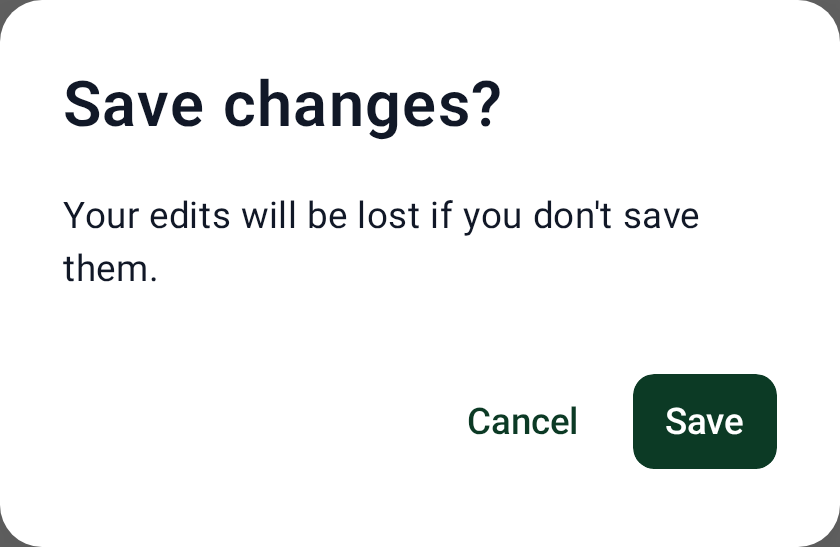
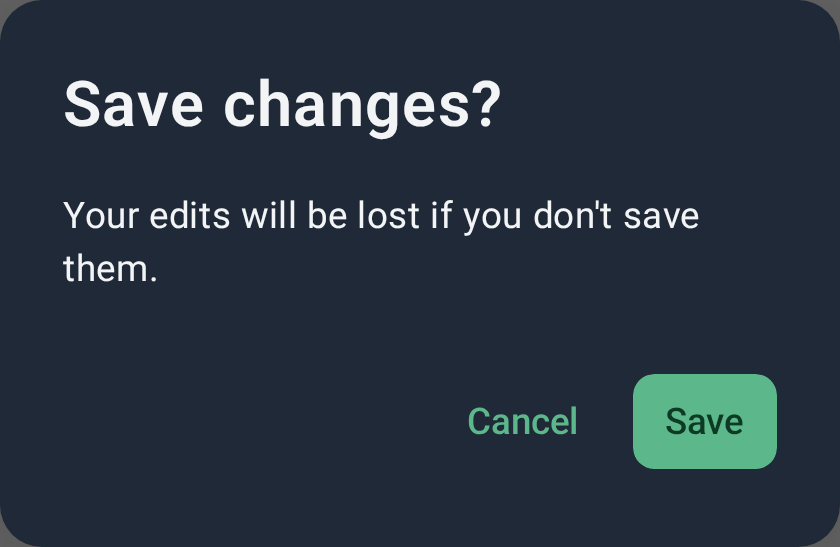

# Dialog

`CWSDialog` — a modal confirmation/alert dialog built from the design system buttons. The
`Destructive` variant styles the confirm action with the danger color.

=== "Light"
    { width="360" }
=== "Dark"
    { width="360" }

## Usage

```kotlin
CWSDialog(
    onDismissRequest = { },
    title = "Delete project?",
    text = "This permanently removes the project and its data.",
    confirmLabel = "Delete",
    onConfirm = { },
    dismissLabel = "Cancel",
    variant = CWSDialogVariant.Destructive, // Default · Destructive
)
```

## Parameters

| Parameter | Type | Description |
|---|---|---|
| `onDismissRequest` | `() -> Unit` | Scrim tap / back |
| `title` / `text` | `String` / `String?` | Title and optional body |
| `confirmLabel` / `onConfirm` | `String` / `() -> Unit` | Confirm action |
| `dismissLabel` / `onDismiss` | `String?` / `(() -> Unit)?` | Dismiss action (null hides it) |
| `variant` | `CWSDialogVariant` | `Default` · `Destructive` |
