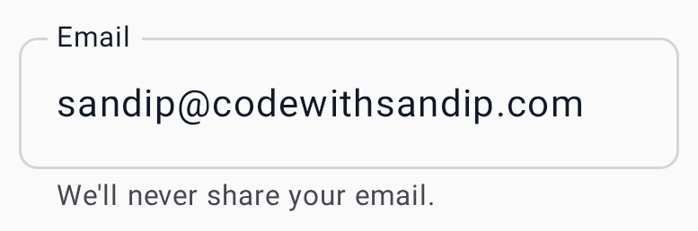
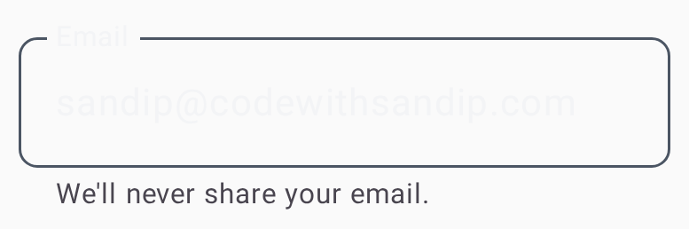

# Text field

`CWSTextField` — an outlined text input with label, placeholder, helper/error text, leading/
trailing icons, and password masking.

=== "Light"
    { width="360" }
=== "Dark"
    { width="360" }

## Usage

```kotlin
CWSTextField(
    value = email,
    onValueChange = { email = it },
    label = "Email",
    placeholder = "you@example.com",
    isError = emailError != null,
    errorText = emailError,
    leadingIcon = Icons.Default.Email,
    keyboardOptions = KeyboardOptions(keyboardType = KeyboardType.Email),
)
```

## Parameters

| Parameter | Type | Description |
|---|---|---|
| `value` / `onValueChange` | `String` / `(String) -> Unit` | Text + change callback |
| `label` / `placeholder` | `String?` | Floating label / empty-state hint |
| `helperText` / `errorText` | `String?` | Supporting text (error replaces helper) |
| `isError` | `Boolean` | Switches to the error style |
| `leadingIcon` / `trailingIcon` | `ImageVector?` | Optional icons |
| `visualTransformation` | `VisualTransformation` | e.g. `PasswordVisualTransformation()` |
| `enabled` / `readOnly` / `singleLine` | `Boolean` | Behavior flags |

States: **Default · Focused · Filled · Error · Disabled**.
