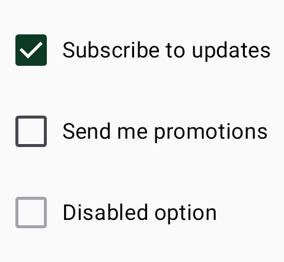
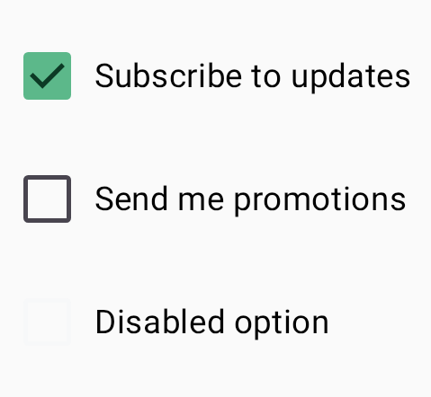

# Toggles

Selection controls — `CWSCheckbox`, `CWSRadioButton`, `CWSSwitch`, and `CWSSlider`. Each accepts
an optional `label` (which makes the whole row tappable) and carries the correct accessibility role.

=== "Light"
    { width="360" }
=== "Dark"
    { width="360" }

## Usage

```kotlin
CWSCheckbox(checked, onCheckedChange = { checked = it }, label = "Subscribe to updates")
CWSRadioButton(selected, onClick = { select() }, label = "Light")
CWSSwitch(checked, onCheckedChange = { checked = it }, label = "Wi-Fi")
CWSSlider(value, onValueChange = { value = it }, valueRange = 0f..1f, steps = 0)
```

## Roles

| Component | Role | Notes |
|---|---|---|
| `CWSCheckbox` | `Checkbox` | Independent on/off choice |
| `CWSRadioButton` | `RadioButton` | One option from a set |
| `CWSSwitch` | `Switch` | A single setting on/off |
| `CWSSlider` | — | Continuous or stepped value (`steps`) |
