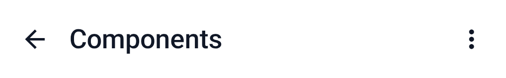
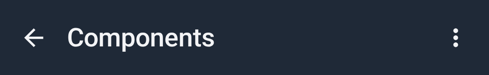

# Top bar

`CWSTopBar` — a top app bar with a title, an optional navigation icon, and trailing actions.

=== "Light"
    { width="480" }
=== "Dark"
    { width="480" }

## Usage

```kotlin
CWSTopBar(
    title = "Destinations",
    navigationIcon = Icons.AutoMirrored.Filled.ArrowBack,
    onNavigationClick = { },
    navigationContentDescription = "Back",
    actions = {
        IconButton(onClick = { }) { Icon(Icons.Default.MoreVert, "More") }
    },
)
```

## Parameters

| Parameter | Type | Description |
|---|---|---|
| `title` | `String` | Screen title |
| `navigationIcon` | `ImageVector?` | Optional leading icon |
| `onNavigationClick` | `(() -> Unit)?` | Handler for the navigation icon |
| `actions` | `@Composable RowScope.() -> Unit` | Trailing actions |
