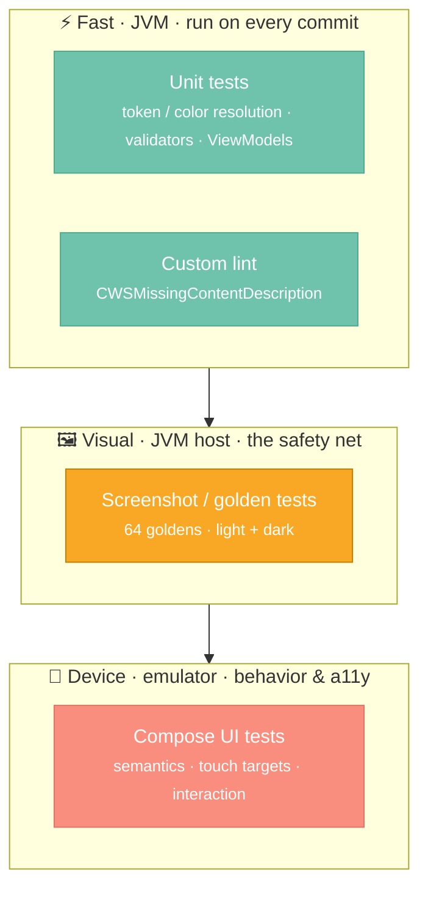

# Testing Strategy

A design system has a testing problem most apps don't: its output is **pixels and behavior**, not
just return values. A button that returns the right state but renders 3dp too narrow in dark mode is
still a bug. So the strategy layers several test types, each catching a different class of failure.



---

## 1. Unit tests (JVM — fast)

Pure-logic tests that need no device. They cover the parts of components that *are* just functions:

- **Token & color resolution** — `core/src/test/…`: `CWSButtonTest`, `CWSColorsTest`,
  `CWSTypographyTest`, `CWSSpacingTest`. Example assertions:

```kotlin
class CWSButtonTest {
    private val scheme = cwsLightColorScheme()

    @Test fun primaryVariant_usesPrimaryContainerAndOnPrimaryContent() { … }
    @Test fun disabledAlpha_is38Percent() { … }   // the 0.38 a11y token
}
```

- **Domain validators & use cases** — `domain/src/test/…`: `ValidatorsTest` (email/password rules),
  `AuthUseCasesTest`, `DestinationUseCasesTest`.
- **ViewModels** — `feature/*/src/test/…`: `LoginViewModelTest`, `HomeViewModelTest`, etc. These use
  a custom **`MainDispatcherRule`** to swap `Dispatchers.Main` for a test dispatcher, then assert on
  `StateFlow<UiState>` transitions (loading → success/error). **Turbine** is the chosen tool for
  asserting on emitted flow values.

---

## 2. Screenshot / golden tests (the safety net)

This is the highest-leverage test type for a design system — it's the only thing that catches
"looks wrong." Built on the official **`com.android.compose.screenshot`** plugin (applied via
`CwsComponentPlugin`), enabled by:

```properties
# gradle.properties
android.experimental.enableScreenshotTest=true
```

Tests live in `core/src/screenshotTest/…` (10 classes, one per component) and are just annotated
previews:

```kotlin
@PreviewTest          // ← discovered by the screenshot plugin
@LightDarkPreview     // ← custom multipreview: renders light AND dark
@Composable
private fun ButtonVariants() {
    CWSTheme { /* every variant / size / state */ }
}
```

The `@LightDarkPreview` multipreview annotation (in `foundation/PreviewAnnotations.kt`) doubles
coverage for free — every test renders in both themes:

```kotlin
@Preview(name = "Light", showBackground = true)
@Preview(name = "Dark", showBackground = true, uiMode = UI_MODE_NIGHT_YES)
internal annotation class LightDarkPreview
```

This yields **64 golden PNGs** under `core/src/screenshotTestDebug/reference/…` covering every
variant × size × state × theme (e.g. `CWSButton` alone has 18 goldens: 4 variants, 3 sizes,
loading, disabled, leading/trailing icons — each in light + dark).

```bash
./gradlew :core:updateDebugScreenshotTest     # record / refresh goldens (after intentional change)
./gradlew :core:validateDebugScreenshotTest   # verify — fails CI on any pixel diff
```

!!! tip "Why this matters in review"
    A theming change that subtly shifts contrast shows up as a **failing image diff in the PR** —
    the reviewer literally sees the before/after. Goldens turn "looks fine to me" into a
    deterministic check, and they run on the **JVM host** (no emulator), so they're cheap enough for
    every PR.

---

## 3. Compose UI tests (device — behavior & accessibility)

Instrumented tests in `core/src/androidTest/…` (11 classes) assert **behavior and semantics** that
screenshots can't — clicks, state changes, and the accessibility tree:

```kotlin
@get:Rule val rule = createComposeRule()

@Test fun disabledButton_doesNotInvokeOnClick() {
    var clicks = 0
    rule.setContent { CWSButton("Go", onClick = { clicks++ }, enabled = false) }
    rule.onNodeWithText("Go").performClick()
    assertEquals(0, clicks)
}

@Test fun button_meetsMinimumTouchTarget() {
    // asserts the 48×48dp target via the semantics tree
}
```

They cover interaction, disabled/loading state, icon rendering, **48×48dp touch targets**, and
`contentDescription` presence — the runtime half of accessibility.

---

## 4. Accessibility checks — built into the pipeline

Accessibility isn't a separate test suite; it's enforced at three layers so it can't regress:

| Layer | Mechanism | Catches |
|---|---|---|
| **Authoring** | `contentDescription` params on components; 48dp via `minimumInteractiveComponentSize()` | designed-in a11y |
| **Static (lint)** | `CWSMissingContentDescription` (below) | callers who forget labels |
| **Runtime (UI test)** | semantics assertions in `androidTest` | broken a11y tree |
| **Visual (golden)** | dark-mode goldens | contrast regressions |

---

## 5. Custom lint rules

The system ships its *own* lint check **inside the published AAR**, so consumers get it
automatically — accessibility guidance travels with the components.

- **Detector:** `MissingContentDescriptionDetector` (`lint-rules/src/main/kotlin/.../lint/`)
- **Issue id:** `CWSMissingContentDescription` · **category** `A11Y` · **severity** `WARNING` ·
  **priority** 6
- **Flags:** calls to `CWSButton` / `CWSTextField` / `CWSCard` that omit `contentDescription`.

Registered via an `IssueRegistry` and wired into the JAR manifest so AGP discovers it:

```kotlin
class CWSIssueRegistry : IssueRegistry() {
    override val issues = listOf(MissingContentDescriptionDetector.ISSUE)
    override val vendor = Vendor("CodeWithSandip", identifier = "com.codewithsandip:ds-core")
}
```

```kotlin
// lint-rules/build.gradle.kts — makes AGP load the registry
tasks.jar { manifest { attributes("Lint-Registry-v2" to "…CWSIssueRegistry") } }
```

```kotlin
// :core ships it transitively to every consumer
dependencies { lintPublish(project(":lint-rules")) }
```

The detector itself is **tested** (`MissingContentDescriptionDetectorTest`) with the lint test
harness (`TestLintTask`) — it asserts the rule *fires* on an unlabeled `CWSButton` and *stays quiet*
when a description is present. A lint rule without tests is just a hopeful comment.

```bash
./gradlew :core:lintDebug
```

---

## 6. What runs where

| Suite | Speed | Needs emulator | Frequency |
|---|---|---|---|
| Unit (tokens, validators, ViewModels) | ⚡⚡⚡ | no | every commit |
| Lint (`CWSMissingContentDescription`) | ⚡⚡⚡ | no | every commit |
| Screenshot / golden | ⚡⚡ | no (JVM host) | every PR |
| Compose UI (semantics, a11y) | ⚡ | yes | pre-merge / nightly |

!!! warning "Emulator caveat"
    Instrumented UI tests must run on an **API ≤ 36** emulator — Espresso 3.7.0 reflects on
    `InputManager.getInstance()`, which was removed in API 37, so UI tests crash on newer images.
    Screenshot and unit tests are unaffected (they run on the JVM).

---

## Summary

- **Layered by failure mode:** unit (logic) → golden (looks) → UI test (behavior/a11y), fast tests
  first.
- **Golden tests are the headline** — 64 light/dark references catch visual regressions on the JVM,
  cheaply, with reviewable image diffs.
- **Accessibility is enforced 4 ways** — authoring defaults, custom lint, runtime semantics, and
  dark-mode goldens.
- **The lint rule ships in the AAR and is itself tested** — consumers inherit the guidance.
